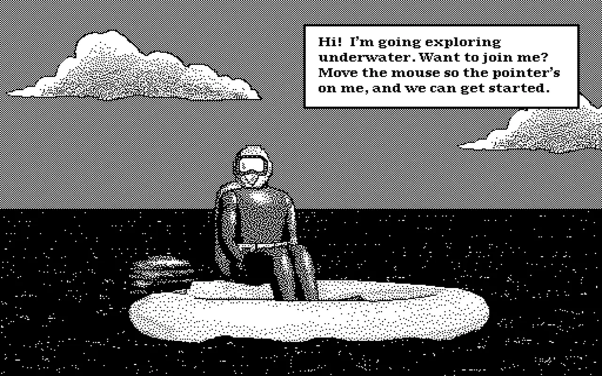

# Mouse Practice (1992)

A browser-based emulator running **Mouse Practice**, a 1992 Apple educational game for young children learning to use a mouse.

## Play

**[Launch Mouse Practice in the browser](https://dknos.github.io/mouse-practice/)**

No installation required — runs entirely in the browser.

The preservation goal is intentionally small and complete: one click opens a working Macintosh environment, mounts the original disk image, and lets the lesson run without a local emulator setup.

## About the game

Mouse Practice was created by Apple Computer for the Macintosh (Motorola 68K). It teaches basic mouse skills through underwater-themed activities:

- **Moving** the mouse
- **Clicking** on targets
- **Dragging and dropping** objects

## How it works

The game runs inside [Mini vMac](https://www.gryphel.com/c/minivmac/), a Macintosh Plus emulator compiled to WebAssembly. It boots System 7 and automatically mounts the Mouse Practice disk image.

Based on [lrusso/MinivMac](https://github.com/lrusso/MinivMac).

## License

The emulator (Mini vMac) is open source under the GPL. Mouse Practice is 1992 Apple abandonware.
